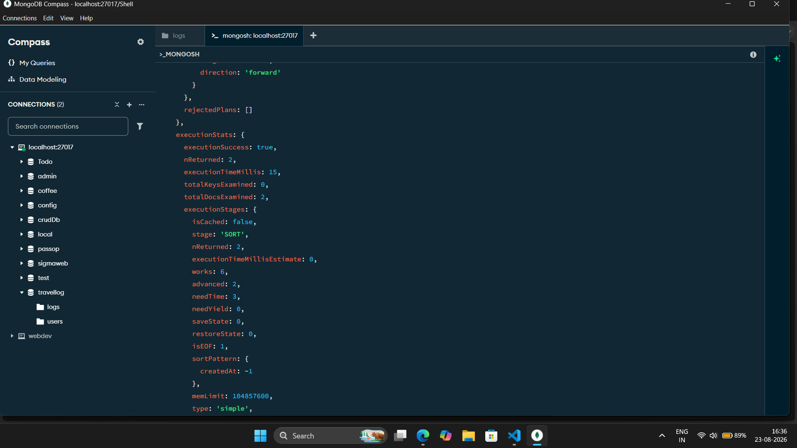
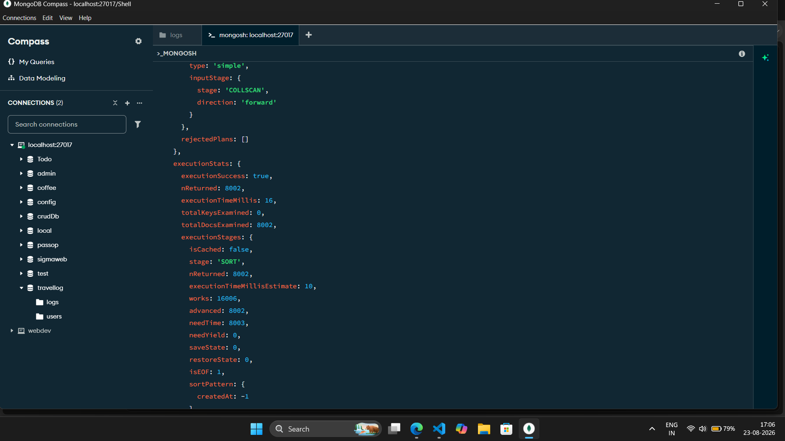
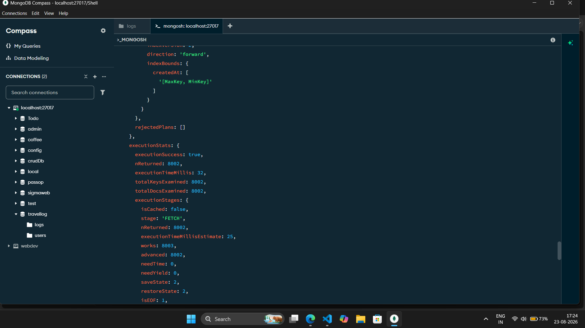

<div align="center">

# 📍 Travel-Log

**Create, share, and explore travel logs — one destination at a time.**

A place to write down where you went, what it was actually like, and the hidden gems worth knowing — then browse everyone else's.

[Live Demo](https://travel-log-project-psi.vercel.app) · [Report a Bug](https://github.com/ayushsareen793/Travel-Log-Project/issues)

</div>

---

## 📖 About The Project

Travel-Log is a full-stack travel journaling app where users sign in, write detailed logs about places they've visited — cover photo, best time to visit, hidden gems, where to eat and stay, what to avoid — and publish them for others to browse and search. It's part personal travel diary, part crowdsourced destination guide.

Built with the Next.js App Router, authenticated with NextAuth, image uploads handled through Cloudinary, and data persisted in MongoDB.

### ✨ Key Features

- 🔐 **OAuth Authentication** — Sign in with GitHub or Google via NextAuth; a `User` document is created automatically on first login
- ✍️ **Rich Travel Logs** — Each log captures title, country, city, date of visit, categories, cover photo, a full write-up, best time to visit, how to get there, hidden gems, where to eat, where to stay, and things to avoid
- 🖼️ **Cloudinary Image Uploads** — Cover photos are uploaded directly to Cloudinary from the browser and the resulting URL is stored with the log
- 🔎 **Explore Page** — Browse all published logs with live search (by title) and category filtering
- 📄 **Individual Log Pages** — Each log gets its own detail page at `/logs/[id]`
- 🏷️ **Category Tagging** — Logs can be tagged with multiple categories (e.g. adventure, food, culture) for filtering
- 👤 **Author Attribution** — Every log is stamped with the publishing user's name, email, and image
- 🚀 **Indexed Queries** — A `createdAt` index and `.lean()` reads keep the logs API efficient as the collection grows (see [Performance Optimization](#-performance-optimization))
- 🎨 **Warm, Editorial UI** — A custom cream/forest-green themed design built with Tailwind CSS (no component library)
- ⚡ **Deployed on Vercel** — Continuous deployment from GitHub on every push

---

## 🛠️ Tech Stack

| Layer | Technology |
|---|---|
| **Framework** | [Next.js 16](https://nextjs.org/) (App Router) |
| **UI Library** | [React 19](https://react.dev/) |
| **Styling** | [Tailwind CSS 4](https://tailwindcss.com/) |
| **Icons** | [Lucide React](https://lucide.dev/) |
| **Authentication** | [NextAuth.js](https://next-auth.js.org/) (GitHub & Google OAuth providers) |
| **Database** | [MongoDB](https://www.mongodb.com/) with [Mongoose](https://mongoosejs.com/) |
| **Image Hosting** | [Cloudinary](https://cloudinary.com/) (unsigned upload preset) |
| **Deployment** | [Vercel](https://vercel.com/) |

---

## 📈 Project Metrics

| Metric | Value |
|---|---|
| **Deployment** | Live on Vercel with continuous deployment from GitHub |
| **OAuth providers** | 2 (GitHub, Google) |
| **Database models** | 2 (User, Log) |
| **Database indexes added** | 1 (`createdAt` descending on `logs`) |
| **API endpoints** | 3 (GET all logs, POST a log, GET a log by id) |
| **Pages / routes** | 6 (landing, login, about, new log, explore logs, log detail) |
| **Reusable components** | 3 (Navbar, Footer, SessionWrapper) |
| **Log fields** | 13 user-entered fields plus author attribution |
| **Load-test dataset** | 8,000 seeded travel logs |
| **Collection scans eliminated** | `COLLSCAN` → `IXSCAN` + `FETCH` |
| **Query work reduced** | 50% (16,006 → 8,003 work units) |
| **API response time at scale** | 41% faster (887 ms → 527 ms) |

---

## ⚡ Performance Optimization

The logs API was optimized by adding a MongoDB index and using `.lean()` queries. Query plans were measured with MongoDB's `explain("executionStats")`, and API response times were measured against a collection padded with 8,000 seeded records.

**Test environment:** local MongoDB (`localhost:27017`), Mongoose ODM, Next.js App Router, `logs` collection. Tested on 2026-08-23.

### What changed

| File | Change |
|---|---|
| `models/Log.js` | Added `LogSchema.index({ createdAt: -1 })` |
| `app/api/logs/route.js` | Added `.lean()` to `Log.find().sort({ createdAt: -1 })` |
| `scripts/applyIndexes.js` | Script to apply the index |

### Baseline (2 real logs)

The API looked fast with only 2 documents, but `totalKeysExamined: 0` showed there was no index, so every query was a full collection scan.

| Metric | Value |
|---|---|
| `executionTimeMillis` | 15 ms |
| `totalDocsExamined` | 2 |
| `stage` | `COLLSCAN` |
| API response time | 21 ms (1.4 KB) |



### At scale (8,000 seeded logs, before optimization)

| Metric | Value |
|---|---|
| `totalDocsExamined` | 8,002 |
| `stage` | `COLLSCAN` |
| `works` | 16,006 |
| API response time | 887 ms |
| Payload size | 8.1 MB |



### After optimization (index + `.lean()`)

| Metric | Before | After | Result |
|---|---|---|---|
| `stage` | `COLLSCAN` | `IXSCAN` + `FETCH` | **No more collection scan** |
| `totalKeysExamined` | 0 | 8,002 | Index now used |
| `works` | 16,006 | 8,003 | **50% less work** |
| API response time | 887 ms | 527 ms | **41% faster** |
| `totalDocsExamined` | 8,002 | 8,002 | Unchanged: the endpoint returns every log |
| Payload size | 8.1 MB | 8.1 MB | Unchanged: no field projection yet |
| `executionTimeMillis` | 16 ms | 32 ms | Slightly higher: the index is traversed for all 8,002 entries |



### Key takeaways

- The **`createdAt` index** replaced the collection scan with an index scan that returns logs already in newest-first order.
- **`.lean()`** skips Mongoose document hydration, which is the main saving when thousands of documents are returned in one request.
- The combined effect was a **41% faster API response** and **50% fewer work units** at 8,000 records.
- **Next bottleneck identified:** the endpoint still returns every log in a single 8.1 MB response. Pagination and field projection are on the roadmap.

The 8,000 test records were removed after testing, so the live database holds only real logs.

---

## 📂 Project Structure

```
Travel-Log-Project/
├── app/
│   ├── Login/                     # Login page (GitHub / Google OAuth)
│   ├── about/                     # About page
│   ├── newlog/                    # Create-a-new-log form (title, photo, write-up, etc.)
│   ├── explorelogs/                # Browse all logs — search + category filter
│   ├── logs/[id]/                  # Individual log detail page
│   ├── api/
│   │   ├── auth/[...nextauth]/route.js   # NextAuth config & sign-in/session callbacks
│   │   └── logs/
│   │       ├── route.js                  # GET all logs (lean, newest first) / POST a new log
│   │       └── [id]/route.js             # GET a single log by id
│   ├── layout.js                   # Root layout (Navbar, Footer, SessionWrapper)
│   └── page.js                     # Landing page
├── components/
│   ├── Navbar.js
│   ├── Footer.js
│   └── SessionWrapper.js           # NextAuth SessionProvider wrapper
├── db/
│   └── Connectdb.js                # Mongoose connection helper (reuses existing connection)
├── models/
│   ├── User.js                     # User schema (name, email, image, provider)
│   └── Log.js                      # Travel log schema + createdAt index
├── scripts/
│   └── applyIndexes.js             # Applies the MongoDB index
└── screenshots/                    # Before/after query-plan screenshots
```

---

## 🗄️ Data Models

**User**
| Field | Type | Notes |
|---|---|---|
| `name`, `email` | String | `email` is unique |
| `image` | String | profile picture from OAuth provider |
| `provider` | String | `github` or `google` |

**Log**
| Field | Type | Notes |
|---|---|---|
| `title`, `country` | String | required |
| `city`, `dateOfVisit` | String / Date | optional |
| `categories` | [String] | array of tags for filtering |
| `coverPhoto` | String | Cloudinary URL |
| `about`, `bestTimeToVisit`, `howToGetThere` | String | free-text sections |
| `hiddenGems` | [String] | list of tips |
| `whereToEat`, `whereToStay`, `thingsToAvoid` | String | free-text sections |
| `author` | Object | `{ name, email, image, id }`, stamped from the session at publish time |

**Indexes:** `logs` → `{ createdAt: -1 }`

---

## 🚀 Getting Started

### Prerequisites

- Node.js 18+
- A [MongoDB](https://www.mongodb.com/atlas) database (Atlas or local)
- A free [Cloudinary](https://cloudinary.com/) account with an **unsigned upload preset**
- OAuth apps registered on [GitHub](https://github.com/settings/developers) and [Google Cloud Console](https://console.cloud.google.com/)

### Installation

1. **Clone the repo**
   ```bash
   git clone https://github.com/ayushsareen793/Travel-Log-Project.git
   cd Travel-Log-Project
   ```

2. **Install dependencies**
   ```bash
   npm install
   ```

3. **Set up environment variables**

   Create a `.env.local` file in the root directory:
   ```env
   # MongoDB
   MONGODB_URI=your_mongodb_connection_string

   # NextAuth OAuth Providers
   GITHUB_ID=your_github_oauth_client_id
   GITHUB_SECRET=your_github_oauth_client_secret
   GOOGLE_CLIENT_ID=your_google_oauth_client_id
   GOOGLE_CLIENT_SECRET=your_google_oauth_client_secret
   ```

   > **Note:** The Cloudinary cloud name and upload preset are currently hardcoded in `app/newlog/page.js` (cloud name `dxey00jzp`, preset `travellog_uploads`). If you're deploying your own copy, update these to your own Cloudinary account before uploads will work.

4. **Apply the database index**
   ```bash
   node scripts/applyIndexes.js
   ```

5. **Run the development server**
   ```bash
   npm run dev
   ```

   Open [http://localhost:3000](http://localhost:3000) in your browser.

### Build for production

```bash
npm run build
npm run start
```

---

## 💡 How It Works

1. A user signs in via GitHub or Google. On first login, a `User` document is created automatically from their OAuth profile.
2. From **New Log**, they fill out a detailed form — trip info, categories, a cover photo, and write-ups for things like best time to visit and hidden gems.
3. The cover photo is uploaded directly to Cloudinary from the browser; the returned secure URL is saved with the log.
4. On publish, a `POST /api/logs` request checks the session server-side, then creates the `Log` document with the author's name, email, and image attached.
5. The **Explore Logs** page fetches all logs (`GET /api/logs`, newest first via the `createdAt` index) and lets visitors search by title and filter by category, client-side.
6. Clicking a log opens its detail page at `/logs/[id]`, which fetches that single log by ID.

---

## 🌐 Deployment

This project is deployed on **Vercel** with continuous deployment connected directly to the GitHub repository — every push to `master` triggers a new production build automatically.

**Live:** [travel-log-project-psi.vercel.app](https://travel-log-project-psi.vercel.app)

To deploy your own copy, import the repo into Vercel and add the same environment variables listed above in the Vercel project settings.

---

## 🗺️ Roadmap

- [ ] Paginate `GET /api/logs` and add field projection to shrink the list payload
- [ ] Move Cloudinary cloud name/preset into environment variables
- [ ] Edit and delete existing logs
- [ ] Per-user "my logs" view
- [ ] Comments or likes on published logs
- [ ] Map view of all logged destinations

---

## 👤 Author

**Ayush Sareen**
- GitHub: [@ayushsareen793](https://github.com/ayushsareen793)

---

## 📄 License

This project currently has no license file. All rights reserved unless a license is added.
